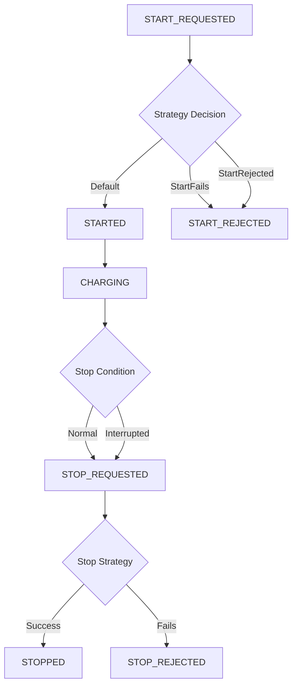

# Charging Session Simulator

The Elvah Charge SDK includes a powerful simulation framework that allows developers to test different charging scenarios without requiring actual hardware or backend services. This simulator has been completely refactored using Gang of Four design patterns to provide maximum flexibility, extensibility, and maintainability.

## Table of Contents

- [Overview](#overview)
- [Available Simulation Flows](#available-simulation-flows)
- [Architecture Overview](#architecture-overview)
- [Quick Start](#quick-start)
- [Custom Implementation Examples](#custom-implementation-examples)
- [Advanced Usage](#advanced-usage)
- [Testing](#testing)

## Overview

The simulator provides realistic charging session behavior for development and testing purposes. It supports multiple predefined scenarios and allows for custom implementations to test edge cases and specific business logic.

### Key Features

- **Multiple Simulation Scenarios**: Predefined flows for common charging states
- **Extensible Architecture**: Easy to add new scenarios using design patterns
- **Reactive State Management**: Real-time session updates via Kotlin Flow
- **Thread-Safe**: Proper concurrent access handling
- **Testable Components**: Each part can be unit tested independently
- **Configuration-Driven**: Switch scenarios through simple configuration

## Available Simulation Flows

| Flow Type | Description | Use Case | Session Progression |
|-----------|-------------|----------|-------------------|
| `Default` | Normal successful charging flow | Happy path testing | START_REQUESTED → STARTED → CHARGING → STOP_REQUESTED → STOPPED |
| `StartFails` | Start request fails after retries | Error handling testing | START_REQUESTED → (retries) → START_REJECTED |
| `StopFails` | Stop request fails | Stop error scenarios | START_REQUESTED → STARTED → CHARGING → STOP_REQUESTED → STOP_REJECTED |
| `InterruptedCharge` | Session gets interrupted during charging | Network/hardware issues | START_REQUESTED → STARTED → CHARGING → (auto) STOP_REQUESTED → STOP_REJECTED |
| `StartRejected` | Start immediately rejected | Permission/authorization issues | START_REQUESTED → START_REJECTED |
| `StopRejected` | Stop request rejected | Payment/settlement issues | START_REQUESTED → STARTED → CHARGING → STOP_REQUESTED → STOP_REJECTED |
| `Custom` | User-defined behavior | Specific test scenarios | Fully customizable |

### Flow Visualization



## Architecture Overview

The simulator is built using several Gang of Four design patterns:

- **Strategy Pattern**: Different simulation behaviors (`ChargingSimulationStrategy`)
- **Factory Pattern**: Object creation (`ChargingSessionFactory`, `SimulationStrategyFactory`)
- **Builder Pattern**: Flexible session configuration (`ChargingSessionBuilder`)
- **Template Method Pattern**: Common session progression logic
- **State Pattern**: Session status management

### Key Components

```kotlin
// Core simulation interface
interface ChargingSimulationStrategy {
    suspend fun generateNextSession(context: SimulationContext): ChargingSession?
    fun shouldContinue(context: SimulationContext): Boolean
    fun reset()
}

// Session creation with validation
interface ChargingSessionFactory {
    fun createSession(builderAction: ChargingSessionBuilder.() -> Unit): ChargingSession
}

// Strategy selection
interface SimulationStrategyFactory {
    fun createStrategy(flow: SimulatorFlow): ChargingSimulationStrategy
}
```

## Quick Start

### Basic Configuration

```kotlin
// Configure the environment to use simulator
val config = ChargeConfig(
    environment = Environment.Simulator(
        simulatorFlow = SimulatorFlow.Default
    )
)

// The FakeChargingRepository will automatically use the configured flow
val repository = RefactoredFakeChargingRepository(chargingStore)

// Start observing sessions
repository.activeSessions.collect { session ->
    println("Session update: ${session?.status1}")
}
```

### Switching Scenarios

```kotlin
// Test different scenarios by changing the configuration
val scenarios = listOf(
    SimulatorFlow.Default,
    SimulatorFlow.StartFails,
    SimulatorFlow.StopFails,
    SimulatorFlow.InterruptedCharge
)

scenarios.forEach { flow ->
    val config = ChargeConfig(
        environment = Environment.Simulator(simulatorFlow = flow)
    )
    
    // Test your charging logic with this scenario
    testChargingFlow(config)
}
```

## Custom Implementation Examples

### Example 1: Replicating Default Scenario

```kotlin
class MyCustomDefaultStrategy(
    private val sessionFactory: ChargingSessionFactory
) : ChargingSimulationStrategy {
    
    override suspend fun generateNextSession(context: SimulationContext): ChargingSession? {
        return when (context.currentStatus) {
            SessionStatus.START_REQUESTED -> {
                // Move to STARTED after a delay
                sessionFactory.createSession {
                    evseId(context.evseId)
                    status(SessionStatus.STARTED)
                    consumption(0.0)
                    duration(0)
                }
            }
            
            SessionStatus.STARTED -> {
                // Begin charging
                sessionFactory.createSession {
                    evseId(context.evseId)
                    status(SessionStatus.CHARGING)
                    consumption(0.5) // Start with small consumption
                    duration(context.secondsSinceLastChange * 2)
                }
            }
            
            SessionStatus.CHARGING -> {
                if (context.stopRequested) {
                    // User requested stop
                    sessionFactory.createSession {
                        evseId(context.evseId)
                        status(SessionStatus.STOP_REQUESTED)
                        consumption(context.currentSession?.consumption ?: 0.0)
                        duration(context.currentSession?.duration ?: 0)
                    }
                } else {
                    // Continue charging with increasing consumption
                    val newConsumption = (context.currentSession?.consumption ?: 0.0) + 0.1
                    sessionFactory.createSession {
                        evseId(context.evseId)
                        status(SessionStatus.CHARGING)
                        consumption(newConsumption)
                        duration(context.secondsSinceLastChange * 2)
                    }
                }
            }
            
            SessionStatus.STOP_REQUESTED -> {
                // Successfully stop
                sessionFactory.createSession {
                    evseId(context.evseId)
                    status(SessionStatus.STOPPED)
                    consumption(context.currentSession?.consumption ?: 0.0)
                    duration(context.currentSession?.duration ?: 0)
                }
            }
            
            else -> {
                // Start the flow
                sessionFactory.createSession {
                    evseId(context.evseId)
                    status(SessionStatus.START_REQUESTED)
                    consumption(0.0)
                    duration(0)
                }
            }
        }
    }
    
    override fun shouldContinue(context: SimulationContext): Boolean {
        return context.currentStatus != SessionStatus.STOPPED
    }
    
    override fun reset() {
        // No internal state to reset
    }
}
```

### Example 2: Custom Flow with Callbacks

```kotlin
class CallbackDrivenStrategy(
    private val sessionFactory: ChargingSessionFactory,
    private val onStatusChange: (SessionStatus, ChargingSession?) -> Unit = { _, _ -> }
) : ChargingSimulationStrategy {
    
    override suspend fun generateNextSession(context: SimulationContext): ChargingSession? {
        val nextSession = when (context.currentStatus) {
            null -> createInitialSession(context)
            SessionStatus.START_REQUESTED -> handleStartRequested(context)
            SessionStatus.CHARGING -> handleCharging(context)
            else -> context.currentSession
        }
        
        // Notify callback of status change
        nextSession?.let { session ->
            onStatusChange(session.status1, session)
        }
        
        return nextSession
    }
    
    private fun createInitialSession(context: SimulationContext): ChargingSession {
        return sessionFactory.createSession {
            evseId(context.evseId)
            status(SessionStatus.START_REQUESTED)
            consumption(0.0)
            duration(0)
        }
    }
    
    private fun handleStartRequested(context: SimulationContext): ChargingSession {
        return sessionFactory.createSession {
            evseId(context.evseId)
            status(SessionStatus.CHARGING)
            consumption(1.0)
            duration(60) // Start with 1 minute
        }
    }
    
    private fun handleCharging(context: SimulationContext): ChargingSession? {
        val currentConsumption = context.currentSession?.consumption ?: 0.0
        val currentDuration = context.currentSession?.duration ?: 0
        
        return if (currentConsumption >= 10.0) {
            // Auto-stop when reaching 10kWh
            sessionFactory.createSession {
                evseId(context.evseId)
                status(SessionStatus.STOPPED)
                consumption(currentConsumption)
                duration(currentDuration)
            }
        } else {
            // Continue charging
            sessionFactory.createSession {
                evseId(context.evseId)
                status(SessionStatus.CHARGING)
                consumption(currentConsumption + 0.5)
                duration(currentDuration + 30) // Add 30 seconds
            }
        }
    }
    
    override fun shouldContinue(context: SimulationContext): Boolean {
        return context.currentStatus != SessionStatus.STOPPED
    }
    
    override fun reset() {
        // Reset any internal state if needed
    }
}
```

### Example 3: Time-Based Simulation

```kotlin
class TimeBasedSimulationStrategy(
    private val sessionFactory: ChargingSessionFactory,
    private val chargingDurationMinutes: Int = 30
) : ChargingSimulationStrategy {
    
    private var sessionStartTime: Long = 0
    
    override suspend fun generateNextSession(context: SimulationContext): ChargingSession? {
        val currentTime = System.currentTimeMillis()
        
        return when (context.currentStatus) {
            null -> {
                sessionStartTime = currentTime
                sessionFactory.createSession {
                    evseId(context.evseId)
                    status(SessionStatus.START_REQUESTED)
                    consumption(0.0)
                    duration(0)
                }
            }
            
            SessionStatus.START_REQUESTED -> {
                sessionFactory.createSession {
                    evseId(context.evseId)
                    status(SessionStatus.CHARGING)
                    consumption(0.0)
                    duration(0)
                }
            }
            
            SessionStatus.CHARGING -> {
                val elapsedMinutes = (currentTime - sessionStartTime) / (1000 * 60)
                val consumptionRate = 7.2 // kW
                val currentConsumption = (elapsedMinutes * consumptionRate / 60.0).coerceAtMost(50.0)
                
                if (elapsedMinutes >= chargingDurationMinutes || context.stopRequested) {
                    sessionFactory.createSession {
                        evseId(context.evseId)
                        status(SessionStatus.STOPPED)
                        consumption(currentConsumption)
                        duration(elapsedMinutes.toInt())
                    }
                } else {
                    sessionFactory.createSession {
                        evseId(context.evseId)
                        status(SessionStatus.CHARGING)
                        consumption(currentConsumption)
                        duration(elapsedMinutes.toInt())
                    }
                }
            }
            
            else -> context.currentSession
        }
    }
    
    override fun shouldContinue(context: SimulationContext): Boolean {
        return context.currentStatus != SessionStatus.STOPPED
    }
    
    override fun reset() {
        sessionStartTime = 0
    }
}
```

## Advanced Usage

### Using Custom Strategies

```kotlin
// Create custom strategy
val customStrategy = MyCustomDefaultStrategy(sessionFactory)

// Inject into repository
val repository = RefactoredFakeChargingRepository(chargingStore)
repository.setSimulationStrategy(customStrategy)

// Or use custom flow configuration
val customFlow = SimulatorFlow.Custom { status, session ->
    println("Status changed to: $status")
}

val config = ChargeConfig(
    environment = Environment.Simulator(simulatorFlow = customFlow)
)
```

### Builder Pattern Usage

```kotlin
val sessionFactory = DefaultChargingSessionFactory()

val customSession = sessionFactory.createSession {
    evseId("DE*CUSTOM*E0000123")
    status(SessionStatus.CHARGING)
    consumption(15.5)
    duration(1800) // 30 minutes
}
```

### State Monitoring

```kotlin
class ChargingMonitor {
    fun startMonitoring(repository: RefactoredFakeChargingRepository) {
        repository.activeSessions
            .filterNotNull()
            .collect { session ->
                when (session.status1) {
                    SessionStatus.STARTED -> logEvent("Charging started")
                    SessionStatus.CHARGING -> logProgress(session.consumption, session.duration)
                    SessionStatus.STOPPED -> logEvent("Charging completed")
                    SessionStatus.START_REJECTED -> logError("Start rejected")
                    SessionStatus.STOP_REJECTED -> logError("Stop rejected")
                    else -> logEvent("Status: ${session.status1}")
                }
            }
    }
    
    private fun logEvent(message: String) {
        println("[${System.currentTimeMillis()}] $message")
    }
    
    private fun logProgress(consumption: Double, duration: Int) {
        println("[PROGRESS] ${consumption}kWh in ${duration}s (${consumption/duration*3600}kW)")
    }
    
    private fun logError(message: String) {
        println("[ERROR] $message")
    }
}
```

## Testing

### Unit Testing Strategies

```kotlin
class DefaultSimulationStrategyTest {
    
    private val sessionFactory = DefaultChargingSessionFactory()
    private val strategy = DefaultSimulationStrategy(sessionFactory)
    
    @Test
    fun `should start charging from initial state`() = runTest {
        val context = SimulationContext()
        
        val session = strategy.generateNextSession(context)
        
        assertThat(session?.status1).isEqualTo(SessionStatus.START_REQUESTED)
        assertThat(session?.consumption).isEqualTo(0.0)
    }
    
    @Test
    fun `should progress from START_REQUESTED to STARTED`() = runTest {
        val context = SimulationContext(
            currentSession = ChargingSession(
                evseId = "TEST",
                status = "test",
                consumption = 0.0,
                duration = 0,
                status1 = SessionStatus.START_REQUESTED
            ),
            sessionCounter = 3
        )
        
        val session = strategy.generateNextSession(context)
        
        assertThat(session?.status1).isEqualTo(SessionStatus.STARTED)
        assertThat(session?.consumption).isGreaterThan(0.0)
    }
}
```

### Integration Testing

```kotlin
class SimulatorIntegrationTest {
    
    @Test
    fun `complete default flow integration test`() = runTest {
        val chargingStore = mockk<ChargingStore>()
        val repository = RefactoredFakeChargingRepository(chargingStore)
        
        val sessions = mutableListOf<ChargingSession?>()
        
        // Collect all session updates
        val job = launch {
            repository.activeSessions.collect { session ->
                sessions.add(session)
            }
        }
        
        // Simulate the flow
        repository.fetchChargingSession() // Banner request
        repository.fetchChargingSession() // Start requested
        repository.startChargingSession()
        
        repeat(5) {
            repository.fetchChargingSession() // Charging progress
        }
        
        repository.stopChargingSession()
        repository.fetchChargingSession() // Final stop
        
        job.cancel()
        
        // Verify flow progression
        val statuses = sessions.filterNotNull().map { it.status1 }
        assertThat(statuses).containsExactly(
            SessionStatus.START_REQUESTED,
            SessionStatus.STARTED,
            SessionStatus.CHARGING,
            SessionStatus.CHARGING,
            SessionStatus.CHARGING,
            SessionStatus.CHARGING,
            SessionStatus.CHARGING,
            SessionStatus.STOPPED
        )
    }
}
```

---

## Related Documentation

- [Main README](../README.md) - SDK overview and installation
- [API Reference](./API_REFERENCE.md) - Complete API documentation
- [Examples](./EXAMPLES.md) - More implementation examples

For questions or issues with the simulator, please refer to the main project documentation or contact the development team.